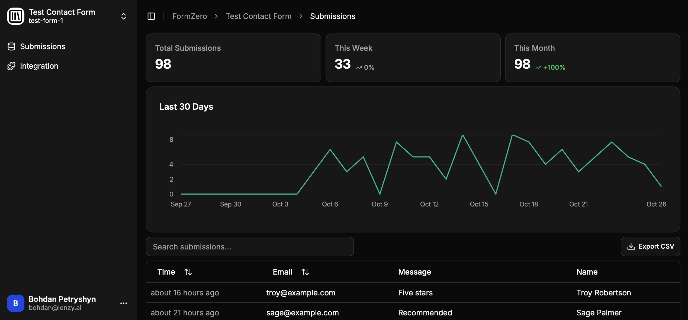

<h1 align="center">FormZero</h1>

<div align="center">
  A forever free, open-source form backend for static sites you can self-host on Cloudflare in one click
  <br/>
  <br/>
  🔓 <em>No paid features.</em> 📀 <em>Own your data.</em> ⚡️ <em>Start in 3 minutes</em>
</div>

<br/>



<div align="center">Perfect for <em>contact forms</em>, <em>waitlists</em>, <em>surveys</em>, <em>newsletter signups</em>, and more.</div>

<br/>

## Why FormZero?

- **Save time** - Form backends are simple software; don't waste time building one for your static site
- **No artificial limits** - Commercial services often restrict you to ~50 submissions/month with no data export
- **Deploy in minutes** - As easy as signing up for a commercial service. Not a single line of code, not even YAML

Use [FormZero](https://github.com/BohdanPetryshyn/formzero) for your next big thing! ⭐ Give it a star to not forget.

<br/>

## Features

- **Submit HTML Forms** - Add FormZero's endpoint to your form's `action` attribute
- **Submit JSON Data** - Send payloads via `fetch` or `XMLHttpRequest`
- **Unlimited Forms** - Create as many as you need
- **Unlimited Submissions** - Receive thousands per hour
- **Analytics Dashboard** - View submission trends and stats
- **Export CSV** - Download all submissions in one click
- **Google Sign-In** - Optional OAuth login with domain restriction
- **Multi-User Mode** - Team access with configurable domain allowlist
- **Spam Protection** - Proof of Work CAPTCHA and honeypot fields (coming soon)
- **Email Notifications** - Add your [Resend](http://resend.com) API key to receive notifications (coming soon)

<br/>

## Deploy in Seconds ⚡

[](https://deploy.workers.cloudflare.com/?url=https://github.com/BohdanPetryshyn/formzero)

Deploy your own serverless form backend in seconds - as easy as signing up for a commercial service:

1. Click the ***Deploy to Cloudflare*** button above
2. Log in to your ***free*** Cloudflare account or create one (***no credit card required***)
3. Follow the prompts - your instance will be running in ***3 minutes***

Everything fits within ***Cloudflare's free tier*** - receive up to ***100,000 submissions/day*** and store up to ***4,000,000 submissions*** for free. Upgrade later for just $5 if needed.

<br/>

### How Deploy to Cloudflare Works

Here's what happens when you click the button:

1. Cloudflare creates a copy of this repository in your GitHub or GitLab account
2. You provide configuration options:
   - **Project name** (e.g. "formzero")
   - **Database name** (e.g. "formzero")
   - **Auth secret** (use [jwtsecrets.com](https://jwtsecrets.com) or `openssl rand -hex 16` to generate one)
3. Cloudflare builds and deploys FormZero to your account
4. You get a unique URL (e.g. `https://formzero.your-domain.workers.dev`) to access your dashboard

Read the [Cloudflare documentation](https://developers.cloudflare.com/workers/platform/deploy-buttons/) for more details.

<br/>

## Configuration

### Environment Variables

FormZero uses two types of configuration:

**Secrets** (set via Cloudflare dashboard or `.dev.vars` for local development):

| Variable | Required | Description |
|----------|----------|-------------|
| `BETTER_AUTH_SECRET` | Yes | Secret key for authentication. Use [jwtsecrets.com](https://jwtsecrets.com) or `openssl rand -hex 16` |
| `GOOGLE_CLIENT_ID` | No | Google OAuth Client ID (see [Google Sign-In Setup](#google-sign-in-setup)) |
| `GOOGLE_CLIENT_SECRET` | No | Google OAuth Client Secret |
| `ALLOWED_EMAIL_DOMAIN` | No | Restrict sign-up to a specific domain (e.g., `example.com`) |

**Public variables** (set in `wrangler.jsonc` or override via Cloudflare dashboard):

| Variable | Default | Description |
|----------|---------|-------------|
| `MULTI_USER_ENABLED` | `false` | Set to `true` to allow multiple users |
| `PASSWORD_AUTH_ENABLED` | `true` | Set to `false` to disable email/password (Google OAuth only) |

Secrets should never be committed to the repository. Public variables in `wrangler.jsonc` are safe to commit and provide defaults.

<br/>

### Google Sign-In Setup

Enable Google OAuth to allow users to sign in with their Google account. This is especially useful when combined with domain restriction for team access.

#### Step 1: Create a Google Cloud Project

1. Go to the [Google Cloud Console](https://console.cloud.google.com/)
2. Click **Select a project** → **New Project**
3. Enter a project name (e.g., "FormZero") and click **Create**

#### Step 2: Configure OAuth Consent Screen

1. In the Google Cloud Console, go to **APIs & Services** → **OAuth consent screen**
2. Select **External** (or **Internal** if using Google Workspace and want to restrict to your organization)
3. Fill in the required fields:
   - **App name**: FormZero (or your preferred name)
   - **User support email**: Your email
   - **Developer contact email**: Your email
4. Click **Save and Continue**
5. On the **Scopes** page, click **Add or Remove Scopes** and select:
   - `email`
   - `profile`
   - `openid`
6. Click **Save and Continue** through the remaining steps

#### Step 3: Create OAuth Credentials

1. Go to **APIs & Services** → **Credentials**
2. Click **Create Credentials** → **OAuth client ID**
3. Select **Web application**
4. Set the **Name** (e.g., "FormZero Web Client")
5. Under **Authorized JavaScript origins**, add:
   - `https://your-formzero-instance.workers.dev` (your deployed URL)
   - `http://localhost:5173` (for local development)
6. Under **Authorized redirect URIs**, add:
   - `https://your-formzero-instance.workers.dev/api/auth/callback/google`
   - `http://localhost:5173/api/auth/callback/google`
7. Click **Create**
8. Copy the **Client ID** and **Client Secret**

#### Step 4: Add Credentials to FormZero

**For Cloudflare deployment:**
1. Go to your Cloudflare dashboard → Workers & Pages → your FormZero worker
2. Go to **Settings** → **Variables and Secrets**
3. Add the following secrets:
   - `GOOGLE_CLIENT_ID`: Your Google Client ID
   - `GOOGLE_CLIENT_SECRET`: Your Google Client Secret

**For local development:**
Add to your `.dev.vars` file:
```
GOOGLE_CLIENT_ID="your-client-id.apps.googleusercontent.com"
GOOGLE_CLIENT_SECRET="your-client-secret"
```

<br/>

### Domain Restriction

Restrict sign-up to users from a specific email domain. This is useful for team/organization access.

**Example:** To only allow users with `@acme.com` emails:

```
ALLOWED_EMAIL_DOMAIN="acme.com"
```

When configured:
- New users must have an email ending in `@acme.com` to create an account
- Existing users can still sign in regardless of domain

**Important:** Domain restriction is only secure with Google OAuth. Email/password sign-up does not verify email ownership, so users could enter any email address. If you need strict domain enforcement, use Google OAuth and consider disabling email/password sign-up.

<br/>

### Multi-User Mode

By default, FormZero runs in single-user mode - only the first person to sign up can access the dashboard. This restriction applies to both email/password and Google OAuth sign-up.

Enable multi-user mode to allow team access:

```
MULTI_USER_ENABLED="true"
```

**Recommended setup for teams:**
1. Enable Google sign-in
2. Set `ALLOWED_EMAIL_DOMAIN` to your company domain
3. Set `MULTI_USER_ENABLED` to `true`
4. Set `PASSWORD_AUTH_ENABLED` to `false` (for secure domain enforcement)

This allows anyone with a company Google account to sign in and manage forms, while ensuring only verified emails from your domain can access the system.

**Note:** In single-user mode with Google OAuth enabled, only the owner can sign in. If someone else tries to use Google sign-in with a different account, they will be blocked.

<br/>

## Tech Stack 🛠️

- **[Cloudflare Workers](https://workers.cloudflare.com/)** + **[D1](https://developers.cloudflare.com/d1/)**
- **[React Router v7](https://reactrouter.com/)**
- **[Tailwind CSS](https://tailwindcss.com/)** + **[shadcn/ui](https://ui.shadcn.com/)**

<br/>

## Contributing 🤝

Contributions are welcome - add features you need or fix bugs by opening an issue or submitting a pull request.

<br/>

## License

MIT

